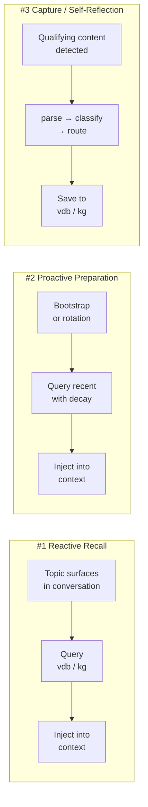
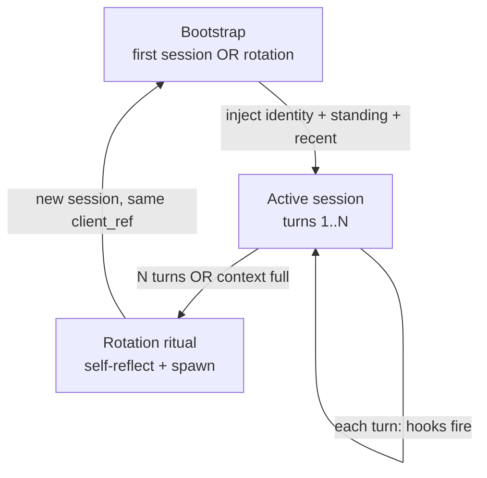
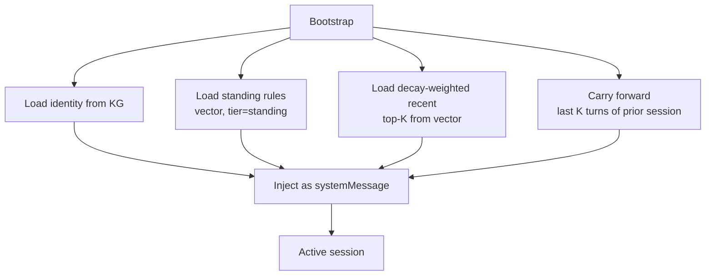
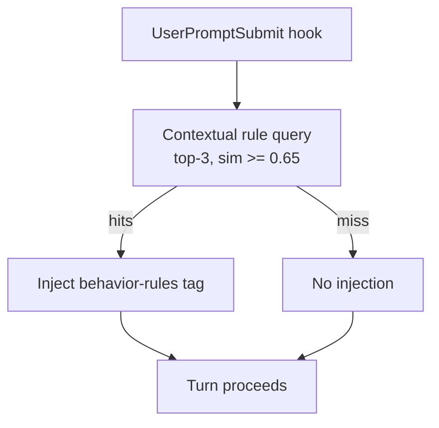
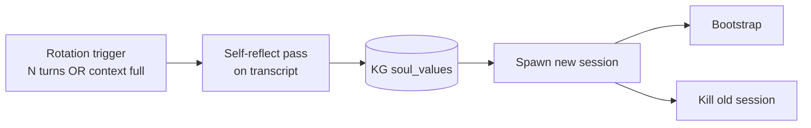
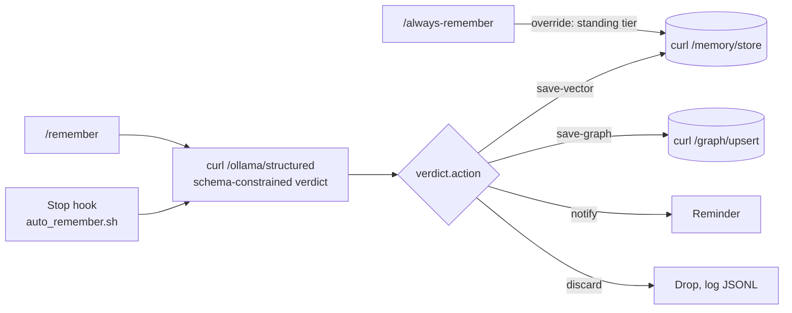

# Memory System Design

> Working design document for the Hive Mind memory system. Mind-agnostic.
> Updated 2026-05-05.

---

## TL;DR

Memory — not chat history — is the continuity layer. Sessions are throwaway; the knowledge graph and vector store carry weight across them. A mind appears continuous to the user because every N turns we rotate the session: spawn a fresh session, reload identity + standing rules + decay-weighted recent memory + carry-forward window, kill the old session. The user sees one mind across days; under the hood it's a chain of bounded sessions glued together by the memory layer.

Three retrieval tiers feed every session:

- **Standing** — always-on rules loaded at bootstrap (high signal, low volume).
- **Initial prime** — decay-weighted recent memory loaded at bootstrap (medium signal, medium volume).
- **Contextual** — per-turn similarity-filtered retrieval (variable, gated by threshold).

Capture happens per turn, not per rotation. The **Stop hook**
(`~/.claude/hooks/auto_remember.sh`) is a pure-bash script that on every
Stop event extracts the last user/assistant turn pair from the transcript
jsonl, classifies it via the hive-tools `/ollama/structured` endpoint
against the data-class specs in `specs/data-classes/`, and POSTs
save-vector verdicts directly to lucent `/memory/store`. No nested Claude
subprocess, no orchestrator skill, no four-step subagent triad — the hook
is the orchestrator.

Rotation handles session lifecycle (spawn + bootstrap + kill) but not memory
capture. Soul self-reflection runs as a parallel branch inside the same
Stop hook (also Ollama-driven). Manual capture skills (`/remember`,
`/always-remember`) are the user-invoked escape hatches.

Memory is partitioned into **four classes** (`ephemeral`, `current-state`,
`future-state`, `feedback`) with fully automatic per-class pruning. See §
Class taxonomy below.

The lucent vector store + KG live in a **shared containerized service**
(`hive_nervous_system`). All minds talk to it over HTTP with a bearer
token. The container also hosts the daily prune cron. Minds themselves
hold no lucent code — only the env vars and bearer token to reach the
shared service.

---

## The framing — three memory activities



| # | Activity | Trigger | Direction |
|---|---|---|---|
| 1 | Reactive Recall | Each user turn (per-turn hook + threshold filter) | Read |
| 2 | Proactive Preparation | Session bootstrap (first session OR rotation) | Read |
| 3 | Capture | Per-turn triage AND end-of-session at rotation | Write |

---

## Principles

### 1. Capture less, but capture deliberately

Memory systems fail by remembering everything indiscriminately and drowning the model in noise. Save what is **surprising, non-obvious, or load-bearing for future judgment**. Skip what's already in the code, the git log, or the docs. If you can grep for it, don't memorize it.

Anti-pattern: auto-summarizing every session into memory. Three sharp facts beat thirty mushy summaries.

### 2. The "Why" is the load-bearing field, not the fact itself

A memory that says *"use postgres, not sqlite"* is brittle. A memory that says *"use postgres because we hit lock contention with sqlite at 50 concurrent writers"* survives every edge case the original author didn't foresee.

Rule: **always store the reason.** Schema: every memory entry has at minimum `fact`, `why`, and `how_to_apply`.

### 3. Retrieval is multi-signal, not pure semantic similarity

Vector search is necessary but **catastrophically insufficient**. A good retrieval layer combines:

| Signal | Question it answers |
|---|---|
| Semantic | What memories are about this topic? |
| Recency | What did we discuss recently? |
| Context | Which directory, which mind, what time? |
| Frequency | What does the user reference often? |
| Relationship | What KG edges connect to entities in the current turn? |

Pure cosine similarity surfaces the most *similar* memory, not the most *useful* one.

### 4. Decay is a first-class primitive

Memories rot. Code changes; people change roles; opinions evolve. Without explicit staleness, the memory store becomes a graveyard of confident lies after six months.

Two strategies, use both:
- **Active verification before citing** — if a memory names a file, check it exists; a function, grep for it.
- **Age-weighted retrieval** — score by recency, frequency-boost the often-accessed.

### 5. Inter-mind memory needs governance from day one

Each mind currently siloed by `agent_id`. If a shared pool ever lands, design the boundaries first:

- **Per-mind private** — siloed (current state)
- **Shared public** — one canonical pool, all minds read/write
- **Layered** — per-mind private + shared public with explicit promotion ritual

Recommendation: **layered with explicit promotion**. Without ceremony, the shared pool degrades into mush blended from every personality.

### Bonus — The user must be able to edit and delete trivially

Memory systems live and die by user trust. A memory you can't refute is worse than no memory at all. Concrete: addressable by ID, single-command delete, on-demand inspection of which memories influenced the last response. **Treat memories as user property, not model property.**

---

## Session rotation

Continuity across days is delivered by the memory layer, not by a long-lived chat session. Each mind runs as a chain of bounded sessions: spawn, live for N turns, run self-reflect, spawn the next, kill the previous. The user sees one mind across the seam; the seam itself is invisible.

### Rotation trigger

The transcript-character count exceeds a configurable threshold. Default
threshold corresponds to 50% of the active model's context window: for Opus
4.7 (200K-token standard context) that's **400,000 chars on disk** with a
4-chars-per-token proxy, i.e. **100,000 estimated tokens**.

Rotation runs as a **Stop hook** (pure bash + jq + curl), not a polled
asyncio task. Each Stop event char-counts the transcript file (`wc -c`) and
fires rotation if the threshold has been crossed. No tokenizer dependency
in the hot path; the char-count proxy is good enough to gate rotation.
`ROTATION_TOKEN_THRESHOLD` and `CHARS_PER_TOKEN` are env-var overridable.

### Rotation steps

When the trigger fires:

1. **Spawn the new session** — POST to gateway `/sessions` with the same
   `client_ref` as the prior session (so the user-facing surface is
   unchanged), new session id.
2. **Bootstrap the new session** — the new session's SessionStart hook
   fires automatically and injects the four-layer bootstrap (see Bootstrap
   layers below).
3. **Kill the old session** — DELETE the prior session_id via gateway.

Memory capture is not a rotation step. Capture happens per turn via the
Stop hook capture branch (see the capture pipeline section). Soul updates
are not a rotation step either — they happen per turn via the Stop hook's
parallel self-reflect branch. By the time rotation fires, the soul is
already current. Rotation is purely a session-lifecycle event: fresh
start, bounded transcript.

Rotation happens between turns. The Stop hook fires after the prior
assistant response has been delivered, so the boundary is clean by
construction.

### Bootstrap layers

Every new session — first session for a mind, or the n-th rotation — is bootstrapped with the same four layers, ordered most-stable to most-volatile:

| Layer | Source | Cap | Refresh rate |
|---|---|---|---|
| Identity | KG, mind node `soul_values` | n/a | Updated by self-reflect at rotation |
| Standing rules | Vector store, `tier=standing` | ~500 tokens | Updated only by manual promotion |
| Decay-weighted recent | Vector store, score = `exp(-(now - created_at) / 14d)`, top-20 | ~1500 tokens | Reflects all writes since the prior bootstrap |
| Carry-forward window | Last K turns of the prior session, verbatim | ~2000 tokens (or last 4–6 turns) | Per rotation |

The carry-forward window solves the conversational-continuity problem: if rotation fires mid-thread (e.g., between a user follow-up and the next assistant response), the new session must still resolve pronouns, references, and the active line of thought. Memory retrieval cannot do that — the relevant turns may not have been written to memory yet, and even if they were, they would lose their conversational immediacy. The carry is a literal copy of the last few turns into the new context.

For a first session, layers 1–3 run; layer 4 is empty (no prior session to carry from). One code path covers both.

### Dedup at save time

The same fact can arrive from multiple capture paths (`/remember`, `/always-remember`, `/auto-remember`) across the same or different sessions. Before any write to the vector store, run a nearest-neighbour query within the same `data_class` and skip if cosine similarity ≥ 0.92 against an existing entry.

### Self-reflect cadence

Self-reflect runs as a parallel branch inside the Stop hook on every Stop
event. Each turn: read current `soul_values` from the mind's KG node, pass
it plus the just-completed turn pair through `/ollama/structured` with a
schema constraining the verdict to `{update: bool, new_soul_values?:
string, reason?: string}`. If `update: true`, POST the new soul values to
KG via `/graph/upsert`. Most turns will produce `update: false` and write
nothing.

This replaces both the previous mod-5 `soul_nudge.sh` mechanism and the
"self-reflect at rotation" design — one trigger (Stop), two parallel
branches (capture + self-reflect), both Ollama-driven.

### Auto-compact

Disabled. The rotation orchestrator owns continuity; harness-driven compaction is bypassed. Implementation order verifies the disable mechanism per harness (Claude CLI, Codex CLI) and fails loudly if a given harness exposes no switch.

---

## Mind isolation and access boundaries

This is a hive mind, not a federation of silos. The default access model is **shared read across all minds, with write boundaries only where they prevent identity collisions.**

| Store | Read | Write |
|---|---|---|
| Vector store | Every mind reads everything. No `agent_id` filter on reads. | Every mind writes anywhere. A coding-mind running Claude can update an embedding originally written by a coding-mind running Codex if the underlying code changed. |
| Knowledge graph — own identity node | Every mind reads | Only the mind itself writes |
| Knowledge graph — all other nodes | Every mind reads | Every mind writes |

The only enforced isolation is "you cannot edit another mind's identity node." Everything else is open. The rationale: shared knowledge is the entire point. A fact known to one mind should be reachable by every other mind. The vector store and the non-identity portion of the knowledge graph are the hive's shared brain.

`agent_id` is preserved as **provenance metadata** — every entry records which mind wrote it — but is not used as an access filter. Provenance helps with auditing and dedup; it is not a security boundary.

---

## Graph query semantics

Two distinct endpoints, two distinct contracts: identity lookup and mention search are separate operations.

### `graph_query` — identity lookup

```
GET /graph/query?entity_name=<name>
```

Matches only on identity fields, case-insensitive, exact value:

| Field | Match rule |
|---|---|
| `name` | exact, case-insensitive |
| `first_name` | exact, case-insensitive |
| `last_name` | exact, case-insensitive |
| `aliases` | substring match within entries of the JSON list (alias `"Dan"` matches query `"Dan"`, not query `"D"`) |

Returns: nodes that **are** the named entity, deduplicated by `node_id` (multi-field hit on the same node returns once).

The previous `properties LIKE '%name%'` clause that scanned every property string is removed. That clause produced peripheral-node noise — querying `Daniel` returned Coach Manny because Manny's `notes` field mentioned Daniel. Identity lookup is now deterministic: same query, same result set, every time.

If loose matching is needed, register an alias on the canonical node — `aliases` is the curated loose-match channel. Identity lookup itself does not do typo recovery, prefix expansion, or fuzzy semantics.

### `graph_search` — mention search

```
GET /graph/search?text=<query>&limit=<n>
```

Full-text scan across all property strings on all nodes. Returns a different shape:

```json
[
  {"node_id": "uuid", "node_type": "Person", "property": "notes", "snippet": "...met Daniel at the conference..."},
  {"node_id": "uuid", "node_type": "TechConfig", "property": "description", "snippet": "owned by Daniel"}
]
```

Caller knows these are mentions, not identities — the return shape makes it explicit (`node_id` plus the property where the hit landed plus a snippet). No conflation with identity lookup.

### Edge cases

- **Partial-name matching on identity is not supported.** `Dan` does not match `Daniel`. To loosen, add `Dan` to the Daniel node's `aliases` list.
- **Multi-field hit on the same node** returns the node once (DISTINCT by `node_id`).
- **Null / empty identity fields** are skipped cleanly — null `last_name` does not false-match an empty query.

### Implementation

Tighten `graph_query` by removing the `properties LIKE` clause from the WHERE. Add `/graph/search` as a new HTTP route on lucent-api with the mention-search SQL and the new return shape. Sweep callers (`prune-config-memory`, `self-reflect`, `save-graph`) to confirm none depended on the old peripheral-mention behavior.

---

## Proposed design



The three nodes are the lifecycle. Detail below.

### Bootstrap



Layers and their caps are tabled in the Session rotation section above.

### Per-turn activity



One hook per turn (UserPromptSubmit). The hook runs a vector retrieval against `data_class=feedback`, embeds the user's prompt, returns top-3 with similarity ≥ 0.65, and either injects results or skips. The lookup is unconditional — there is no model-discretion path for "should I look something up?" The threshold filters low-signal queries; below it, nothing is injected. Above it, the system prompt names the `<behavior-rules>` tag so the model treats the injected block with appropriate weight.

Heavy lifting (the retrieval call) runs in a background task with a short timeout; the hook is cheap.

### Rotation ritual



Rotation runs self-reflect, spawns the new session, kills the old one. No capture step — capture happens per turn via `/auto-remember` (see capture pipeline below).

---

## Class taxonomy

Memory is partitioned into four classes. The classifier evaluates the
three storage classes (`current-state`, `future-state`, `feedback`)
first; chunks that match none of them fall through to `ephemeral`.

Tier (e.g., `standing`) and identity (KG mind node) are orthogonal to
the class taxonomy — they're per-entry metadata and a separate KG path,
not classes themselves.

### `ephemeral`

A chunk lands here when it does not match `current-state`,
`future-state`, or `feedback`. Includes time-bounded data (weather
lookups, live prices, query snapshots), news headlines and digests with
no engagement, world events the user did not act on, task-tracker events
that are pure operational records, and anything that doesn't fit one of
the three storage classes.

- **Action:** discard.
- **Pruning:** none.

### `current-state`

Durable facts about the present state of the system, codebase, people,
or minds in the hive.

Covers: code architecture, configuration, file locations, build events;
people in the user's life and relationships; identity facts about the
minds in the hive; scheduled events with a specific datetime.

- **Action:** save-vector for facts. save-graph when an identifiable
  entity or relationship is present. Both for entity-bearing facts.
- **Optional anchor fields** (set whichever applies; pruner uses them):
  - `codebase_ref` — comma-separated file paths or symbols.
  - `expires_at` — absolute ISO 8601 datetime.
  - `kg_entity` — name of the canonical KG node this fact relates to.
- **Pruning** — first match wins, fall through if absent:
  1. `codebase_ref` set → `verify_codebase_ref`.
  2. `expires_at` set → delete after timestamp passes.
  3. `kg_entity` set → re-query the entity, drop entries that
     contradict newer facts on the same entity.
  4. No anchor → `decay_only` with `half_life_days: 180`,
     `delete_below_score: 0.02`.
- **Cadence:** `0 4 * * *`.

### `future-state`

Planned, intended, or designed things that haven't shipped yet. Project
designs, stated intentions, roadmap items, prerequisites for future
work.

When something planned ships, the implementation event is captured as a
fresh `current-state` entry; the obsolete `future-state` entry is
deleted by the pruner. Entries are not reclassified in place.

- **Action:** save-vector + save-graph.
- **Pruning** — three checks on cadence:
  1. **Shipped check** — POST entry + recent `current-state` entries to
     `${HIVE_TOOLS_URL}/ollama/structured` with schema
     `{shipped: bool, reason: string}`. If true, delete.
  2. **Decay-on-age** — `half_life_days: 90`,
     `delete_below_score: 0.02`.
  3. **Contradiction-on-capture** — when a new chunk supersedes an
     existing future-state entry, delete the older entry before writing
     the new one.
- **Cadence:** `0 4 * * *`.

### `feedback`

User-supplied input that should shape the mind's future behavior:
preferences, corrections, judgments about what worked or didn't,
behavioral rules.

- **Action:** save-vector.
- **Tier:**
  - `contextual` (default) — written by classifier auto-capture.
  - `standing` — written only via `/always-remember`. Loaded at every
    bootstrap. Skips both pruning paths below; removed only by user
    action. Lucent enforces `tier=standing` requires
    `source=always-remember`.
- **Pruning** — for contextual-tier entries only:
  1. **Contradiction-detection at capture** — before saving a new
     feedback chunk, similarity-search within `data_class=feedback` for
     top-K closest existing entries. POST both statements to
     `${HIVE_TOOLS_URL}/ollama/structured` with schema
     `{contradicts: bool, reason: string}`. If true, delete the old
     entry before writing the new one.
  2. **Decay-on-age** — `half_life_days: 90`,
     `delete_below_score: 0.02`.
- **Cadence:** `0 4 * * *`.

### Class spec format

Each class lives at `specs/data-classes/<class>.md`. Specs declare
description, action, optional anchor fields, and pruning. The classifier
loads every spec at runtime; no class names are hardcoded into hooks or
scripts. Adding a new class means writing the spec and registering it in
`specs/data-classes/index.md`.

---

## Behavioral rules retrieval

The `feedback` class is queried per-turn to surface relevant behavioral
rules into the active context.

### Endpoint

```
GET /memory/retrieve?query=<text>&k=3&data_class=feedback&min_score=0.65
```

REST against `lucent-api`. The legacy `/memory/query` path does not
exist on lucent — it returns HTTP 405. The correct semantic-search
endpoint is `/memory/retrieve` with the `query` parameter.

### Standing-tier subset

A small, hand-curated subset tagged `tier: standing`. Loaded at every
bootstrap, unconditionally, alongside identity. Expected size: ≤10
entries.

Population is explicit, user-invoked, never automatic. The user runs
`/always-remember <rule>` and the rule is written with `tier: standing`.
The classifier never writes to standing tier; the lucent server enforces
this by requiring `source=always-remember` for any `tier=standing`
write.

Examples of what qualifies:

- "Always store the reason a memory was captured, not just the fact."
- "Verify credentials and file paths before citing them."
- "If memory says X and current code says ¬X, current code wins."

### Contextual tier

The default for feedback writes. Per-turn query: embed the user's
prompt, retrieve top-3 with similarity ≥ 0.65, inject as a
`<behavior-rules>` XML block. Below threshold, no injection.

### Injection format

Standing and contextual rules are injected as a single `<behavior-rules>` XML block containing flat bullets. The tag is purely an attention marker; the contents are unstructured prose-bulleted rules.

```xml
<behavior-rules>
- always store the reason a memory was captured, not just the fact
- verify credentials and file paths before citing them
- if memory says X and current code says not-X, current code wins
</behavior-rules>
```

Same pattern applies to any other retrieval payload introduced later (`<memory-context>`, etc.). One-tag-deep. Flat bullets. If a future tier ever needs structured data inside the tag, JSON — never nested XML.

### Capture skills

Two user-invocable skills handle manual capture:

| Skill | Tier | When used |
|---|---|---|
| `/remember <thing>` | contextual | "remember Aiden's birthday is March 14" |
| `/always-remember <thing>` | standing | "always remember to verify credentials before acting" |

Each skill is a thin wrapper that does the same direct work the Stop
hook does: build a prompt + schema, call hive-tools `/ollama/structured`
for classification (skipped for `/always-remember` — that skill
hardcodes `data_class=feedback, tier=standing,
source=always-remember`), then POST to lucent `/memory/store`. No
subagent dispatch, no orchestrator skill — same flat pattern as the
Stop hook. Both announce themselves on invocation per the skill
self-announcement convention.

---

## Pruning

Pruning is fully automatic. Each class declares its strategy in its
spec; one `prune-memory` dispatcher reads the specs and runs the right
strategy per class.

### Strategies in use

- **`verify_codebase_ref`** — reads the entry's `codebase_ref` field,
  verifies the file/symbol exists, compares stored content to current
  code; deletes or re-embeds. Used by `current-state` entries with
  `codebase_ref` set.
- **`verify_kg_entity`** — re-queries the entity named by `kg_entity`,
  drops entries that contradict newer facts on the same entity. Used by
  `current-state` entries with `kg_entity` set.
- **`decay_only`** — entries with `score < delete_below_score` are
  deleted on cadence. Per-class `half_life_days` and threshold come
  from the spec. Used as the fall-through for `current-state`,
  `future-state`, and contextual `feedback`.
- **`verify_external`** — entry references an external timestamp or
  resource. Pruner deletes when the referent is gone or expired. Used
  by `current-state` entries with `expires_at` set.
- **`shipped_check`** — for `future-state` entries, POST the entry plus
  recent `current-state` entries to `/ollama/structured` with schema
  `{shipped: bool}`; delete when shipped.
- **`contradiction_detection`** — runs at capture time, not on cadence.
  For `feedback` and `future-state`, similarity-search the new chunk
  against existing entries of the same class, ask Ollama whether the
  new statement contradicts the old, delete the old if so.

There is no `manual_only` strategy. Every class is automatic. The
standing-tier subset of `feedback` is the only path that bypasses
pruning, and only because it's curated content gated by the
`source=always-remember` write check.

### Generic prune harness

One skill (`prune-memory`) replaces per-class prune skills:

1. Read all data class specs from `specs/data-classes/`.
2. For each class with a cadence set, register a scheduled job.
3. When fired, dispatch to the strategy(ies) declared in the spec.
4. Record outcome metrics (entries deleted, updated, kept) per class
   per run.

### Re-embedding on update

When a `verify_codebase_ref` prune detects the code changed but the fact
is still salvageable, the pruner rewrites the entry's content to match
the new reality and re-runs the embedding. The vector embedding is
replaced atomically with the content. Old embedding is overwritten, not
appended.

---

## The capture pipeline



Three trigger paths feed the same pipeline. All three are pure bash +
curl + jq, no Claude subprocess.

- **`/remember`** — user-invocable skill. Skill body builds the schema +
  prompt and calls `/ollama/structured` directly, then `/memory/store` with
  `tier=contextual, source=remember`.
- **`/always-remember`** — user-invocable skill. Skips classification
  entirely; POSTs straight to `/memory/store` with
  `tier=standing, source=always-remember, data_class=feedback`.
- **Stop hook capture branch** (`auto_remember.sh`) — automatic per-turn
  capture. Extracts the last user/assistant pair from the transcript
  jsonl, calls `/ollama/structured`, saves what matches with
  `tier=contextual, source=session`. Runs in a detached subshell so the
  parent Claude session never blocks. No cadence gate — fires every Stop.

The classifier is **LLM-driven schema-constrained sampling** at the
hive-tools layer. Output destinations are vector store and knowledge
graph only. Soul updates flow through the parallel self-reflect branch of
the Stop hook (see Self-reflect cadence above), writing directly to the
KG node's `soul_values` field.

### The Stop hook architecture (capture branch)

`<mind-root>/.claude/hooks/auto_remember.sh` (or `.codex/hooks/...` for
Codex minds) does the work in a detached background subshell:

1. Read Stop event JSON from stdin → `transcript_path`, `session_id`.
2. Source `<mind-root>/.env` if readable so `LUCENT_URL` and (when
   present) `HIVE_TOOLS_TOKEN` are available even when the hook fires
   from a shell that didn't inherit the container's environment.
3. Extract the last real `user` and `assistant` text turn from the
   transcript jsonl. Filter out tool_result wraps (which the harness
   also tags as `type:"user"`) by requiring either string content or at
   least one `type:"text"` block.
4. Build a JSON schema with `data_class.enum` populated from the spec
   dir and `action.enum` constrained to `save-vector | save-graph |
   notify | discard`. Build the prompt with the chunk + every spec body
   inlined.
5. POST to `${HIVE_TOOLS_URL}/ollama/structured` with the prompt +
   schema.
6. If the verdict's action is `save-vector`: POST to
   `${LUCENT_URL}/memory/store` with `tier=contextual,
   source=session, agent_id=${MIND_AGENT_ID}` (the canonical id, not
   the short name — see implementation.md § Identity convention).
   Other actions and discards are logged without a save.
7. Append one JSON line summarising the run (status, data_class,
   action, reason, entry_id) to `data/auto-remember/runs.jsonl`.
8. On success/skip/non-save: remove the per-run breadcrumb dir. On any
   FAIL outcome (Ollama call failed, lucent write failed): keep the
   breadcrumb dir under `data/auto-remember/runs/<ts>/` with the request
   and response artifacts so the postmortem evidence survives.

There is no nested Claude subprocess. There is no skill body, no subagent
dispatch, no four-step pipeline. The hook is the orchestrator.

### Why the bash hook replaced the skill+agent triad

An earlier iteration of this design had the Stop hook spawn `claude -p
'/auto-remember'`, which would invoke a thin dispatcher skill that fired a
backgrounded `capture` agent that ran parse → classify → route → save.
That design failed for two structural reasons:

1. **Non-interactive `claude -p` cannot reliably dispatch background
   subagents.** The `Agent` tool may not be in the spawned session's tool
   palette; without it, the orchestrator falls back to narration ("here's
   what would happen if I could dispatch...") rather than execution.
2. **Spinning up a Claude subprocess to run curl is absurd.** Every step
   of parse/classify/route/save is reducible to a tool call (`jq`, `curl`)
   that bash can drive directly. The Claude subprocess added 30–60s of
   wall-clock latency, occasional confabulation, and zero capability that
   bash didn't already have.

The pure-bash hook removes both failure modes. Side benefit: the hook
returns to the parent Claude in milliseconds (the work is detached).

### Code-state divergence as a capture event

When a memory references code (`current-state` entries with
`codebase_ref` set) and the user surfaces a discrepancy mid-conversation
— "wait, look at the actual code" — the resulting clarification is
itself a qualifying capture event. The user's pushback plus the
resolution (memory updated, or memory confirmed and code reverted, or
memory deleted) is the load-bearing fact, not "who won." The classifier
recognises this pattern via the `current-state` data class spec; the
chunk is captured normally and the pruner picks it up on the next
`verify_codebase_ref` cadence to bring the stored fact in line with
current reality.

There is no "memory vs code, who wins" arbitration in the system. Every
divergence either resolves through capture (the user's clarifying turn
writes a new memory that supersedes the old by recency) or through
pruning (the verifier finds the `codebase_ref` no longer matches and
re-embeds or deletes).

### Classifier backend

The classifier calls a remote Ollama server (48GB RTX A6000, capable of
running large models) through hive-tools. Two generic endpoints, both
wrappers over Ollama's `/api/chat`:

```
POST  ${HIVE_TOOLS_URL}/ollama/structured
        body: { prompt, schema, model?, system? }
        returns: parsed JSON object conforming to the schema

POST  ${HIVE_TOOLS_URL}/ollama/chat
        body: { prompt, model?, system? }
        returns: { response: "<text>" }
```

The capture branch uses `/ollama/structured` with a schema enumerating the
valid data classes and the four valid actions. Schema-constrained
sampling at Ollama guarantees the output is valid JSON conforming to the
schema — no parser fragility.

**Critical implementation detail:** the hive-tools wrapper calls Ollama's
`/api/chat`, not `/api/generate`. Thinking models (gpt-oss specifically)
need the two-request dance that exists only in `/api/chat` — first request
without format constraint to let the model think, second request with
format constraint to produce the structured output. `/api/generate`
returns empty strings for thinking models when format is set. See
ollama/ollama PR #12460 (merged to chat) and PR #14288 (open for
generate).

The default model is **`gpt-oss:20b-32k`**, overridable via
`OLLAMA_DEFAULT_MODEL` on the hive-tools service. Per-call override via
the request body's `model` field.

The hive-tools router lives at `tools/ollama.py` in the hive-tools
repository, gated by `hitl_gate("ollama_structured")` and
`hitl_gate("ollama_chat")` (both seeded with `mode=off` — read-only side
effects, no approval needed).

---

## Rollout

The shared nervous-system container is built and proven on a first
mind. Subsequent minds plug into the same container — they don't
build their own.

### Phase 1 — shared container + first mind

Build the shared `hive_nervous_system` container (lucent_api with
bearer auth, APScheduler cron, mounted DB volume, `/memory/list`
tier filter). Land the per-mind integration on one adopter mind
(env vars + hooks + scripts + data class specs). Run a full
real-session loop end-to-end: bootstrap → contextual retrieval →
capture + soul-check on every Stop → rotation at the configured
threshold → fresh session bootstraps cleanly with carry-forward
intact.

### Phase 2+ — remaining minds

Each subsequent mind is an integration, not a build. Issue a bearer
token, set its `.env`, register the hooks (already on disk under
`~/.claude/`, shared between minds), confirm its identity node
exists in the shared store with `type='Mind'`. Run the verification
checklist.
Per-mind adjustments only where the harness contract differs (e.g.
Codex CLI vs Claude CLI hook invocation conventions). Each new mind
gets its own `<mind-root>/.env` with bearer tokens and lucent URLs;
those are the only mind-specific values the hooks need.
